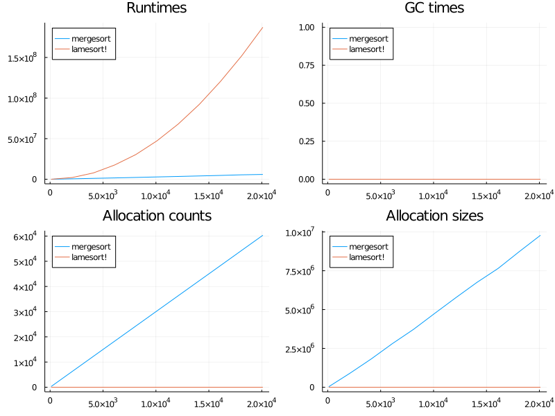

# BigO

[](https://endremborza.github.io/BigO.jl/stable)
[](https://endremborza.github.io/BigO.jl/dev)
[](https://github.com/endremborza/BigO.jl/actions)
[](https://codecov.io/gh/endremborza/BigO.jl)

Julia library for complexity plotting and estimation

## Quickstart

```julia
using Random
using BigO


function lamesort!(a)
    for i in axes(a,1)
        for j in 1:i
            if a[i] < a[j]
                 a[j], a[i] = a[i], a[j]
            end
        end
    end
end

function _merge(a1::AbstractArray{T, 1}, a2::AbstractArray{T, 1}) where {T}
    n1, n2 = size(a1,1), size(a2,1)
    n = n1 + n2
    out = Array{T,1}(undef, n)
    i, j = 1, 1
    while i + j <= n + 1
        if (i > n1) e = a2[j]; j += 1
        elseif (j > n2) e = a1[i]; i += 1
        elseif (a1[i] > a2[j]) e = a2[j]; j += 1
        else e = a1[i]; i += 1 end
        out[i+j - 2 ] = e
    end
    return out
end

function mergesort(a)
    n = size(a, 1)
    n == 1 && return a
    h = n ÷ 2
    return _merge(mergesort(a[1:h]), mergesort(a[h+1:n]))
end


report = RunReport([mergesort, lamesort!], randperm, 100:1000:10100, seconds=0.2; samples=200)
report |> bigos
```

> Dict{String,String} with 2 entries:
>  "mergesort" => "O(n log n)"
>  "lamesort!" => "O(n^p)" 

```julia
using Plots
report |> plot
```


